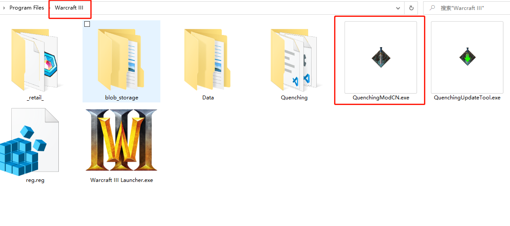
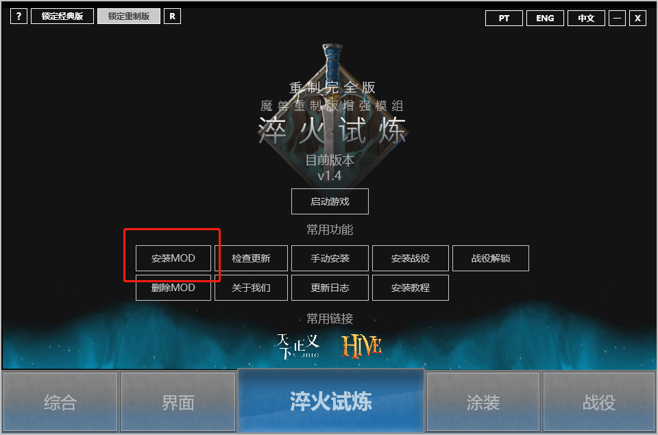

# 常规安装

常规安装指在 \[淬火试炼\] 控制台文件 **QuenchingModCN.exe** 能够正常工作的情况下

直接使用控制台进行安装

这是大部分情况下使用的安装方式

相对来说也是最为轻松的

## 下载

在官方网站或者Hiveworkshop获取最新的下载地址:




[https://www.hiveworkshop.com/forums/quenching-mod.777/](https://www.hiveworkshop.com/forums/quenching-mod.777/)


选择**客户端**进行下载

## 安装

下载MOD并将其放置在魔兽争霸的根目录

注意每个人的魔兽安装路径可能是不同的

双击打开控制台，点击 **\[安装MOD\]** 即可


_如果在安装的过程中进度条停住了较长时间，重新打开控制台并且点击安装即可_‌


使用**控制台/战网/网易对战平台**打开即可

