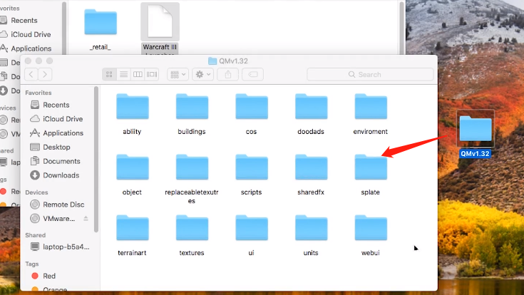
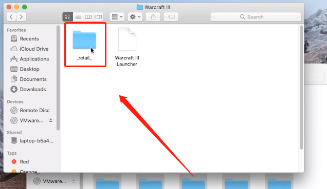

# Mac安装

目前的操作系统还不支持Windows之外的操作系统

因此需要额外的安装步骤

### 模拟器

对于比较资深的用户，我们推荐使用Paralles运行MOD



如果你对于虚拟操作系统或者相关知识不足，请使用以下步骤

### 下载完整包

在官方网站下载MOD完整包体



选择**完整包**

### **安装**

解压完整包，并且将其中的文件取出



将 _\_retail\_ 复制到魔兽根目录，并且覆盖_



打开 _Terminal_ ，并且输入，回车确认

```text
 defaults write "com.blizzard.Warcraft III" "Allow Local Files" -int 1
```

使用**战网或者网易对战平台**打开即可

